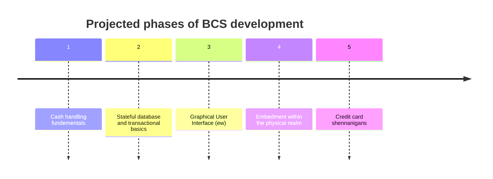

# BeecommSucks
So BeeComm sucks ass, and I want to make a better software to run on cash registers.</br>
Henceforth, this project shall be known as BeeCommSucks - or BCS in short.

## So basically...
I have some experience with programming. I work with cash-registers. I work with the dreaded <i>BeeComm</i> register system.</br>
It sucks major ass. I don't like it. So I'm going to make an open source alternative that'll be an overly ambitious project that'll never be finished!</br>
## So how will it be done?
In short - through immensse difficulty.</br>
In long, I plan to release this in a multi-phased plan. I plan on five stages:

###  Phase 1 - Cash handling fundementals
I will be implementing the basics of handling cash in a physical register setting. Whether to overcomplicate things or not is a constant debate, but this will probably be done by constructing a rudementary database, then implementing a ```CashRegister``` class that will handle all interactions with actual physical money, including maybe tracking actual denominations.
<b>To-do List:</b>
- [ ] Function to get a bill and the amount paid, outputting the amount of change.
- [ ] Basic DB to keep information about cash (starting cash amount, withdrawals and deposits, etc.)
- [ ] Function to add or withdraw cash from the till.

### Phase 2 - Stateful database and transactional basics
This here is the part I assume will take the second most time. It will include setting up a database for the register, requiring a lot of careful planning that I'm not going into right now as I don't give a fuck.</br>
<b>Functions may include:</b>
- [ ] Itemization of... well, items.
- [ ] Transaction history
- [ ] Fuck you.

### Phase 3 - GUI (Eww)
I, as a lover of hacking and practicality, despise making GUIs. Alas, I haven't a choice.
Some things though I will note to myself:
- [ ] Make big buttons
- [ ] Make consistently sized buttons
- [ ] Give it an actual good colour scheme
- [ ] It doesn't have to look modern, it has to work
- [ ] Don't use C# for the fucking GUI

### Phase 4 - Embedment within the physical realm
Make a physical proof of concept, because as we know your software will be flawless and hardware is expensive and I don't wanna sink into that just yet.

### Phase 5 - Credit card shennanigans
I... I have not the slightest inkling of an idea as to how to go about this, hence why it's the last stage.</br>
Guess we'll burn that bridge when we get to it. Worst case scenario I'll hackjob some sort of abuse to Venmo-adjacent services.